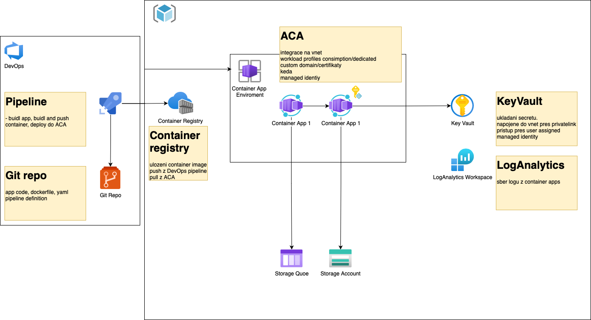

# Příprava prostředí



## Cíl
- Přípravit prostředí které bude obsahovat:
    - Resource grupa v které budou všechny ostatní zdroje
    - Azure Container Registry
    - Azure Key Vault
    - Managed identity - nastavit prava po povoleni stahovani image z ACR
    - Container Enviroment
    - Container App - s nastavenou managed identiry, external ingress

## Postup a materialy

### Nastaveni subskripce a az cli

Zapnutí potřebných extension v az cli a zaregistrování provideru v Azure tenantu

```
az extension add --name containerapp --upgrade
az provider register --namespace Microsoft.App
az provider register --namespace Microsoft.OperationalInsights
az provider register --namespace Microsoft.ContainerService
az provider register --namespace Microsoft.KeyVault
```

Nastaveni proměnných pro dalsi snipety
```
LOCATION=swedencentral
RESOURCE_GROUP=ms-hackaton-public
KEYVAULT_NAME=hackaton-kv-43
ACR_NAME=mshackacr43
ACA_ENV_NAME=ContainerAppEnvPublic
ACA_APP_NAME=app-1
ACA_IDENTITY_NAME=ContainerAppEnv-uaa
```

### Create resource group

```
az group create \
    --location $LOCATION \
    --resource-group $RESOURCE_GROUP
```


### Create container registry

Container registry pro container image aplikaci
```
az acr create \
    --resource-group $RESOURCE_GROUP \
    --name $ACR_NAME \
    --sku Basic

ACR_ID=`az acr show --resource-group $RESOURCE_GROUP --name $ACR_NAME --query "id" -o tsv`
```


### KeyVault

Bezpečné uložení secretu, certifikatu atd..
```
az keyvault create \
    --name $KEYVAULT_NAME \
    --resource-group $RESOURCE_GROUP
```


### Contariner App Environment

Vytvoření identity pro nastaveni přístupu ACA k ostatnim zdrojum v Azure (container registry, Key vault, atd..)

```
az identity create \
    --resource-group $RESOURCE_GROUP \
    --name $ACA_IDENTITY_NAME

ACA_IDENTITY_ID=`az identity show --name $ACA_IDENTITY_NAME -g $RESOURCE_GROUP --query "principalId" -o tsv`
```

Přidání role AcrPull v container registry
```
az role assignment create \
    --assignee $ACA_IDENTITY_ID \
    --role AcrPull \
    --scope $ACR_ID
```

### Create container app environment

```
az containerapp env create \
    --name $ACA_ENV_NAME \
    --resource-group $RESOURCE_GROUP \
    --location $LOCATION \
    --enable-workload-profiles
```

```
az containerapp create \
    --name $ACA_APP_NAME  \
    --resource-group $RESOURCE_GROUP \
    --environment $ACA_ENV_NAME \
    --user-assigned /subscriptions/XXXX/resourcegroups/$RESOURCE_GROUP/providers/Microsoft.ManagedIdentity/userAssignedIdentities/$ACA_IDENTITY_NAME \
    --ingress external \
    --target-port 80
```